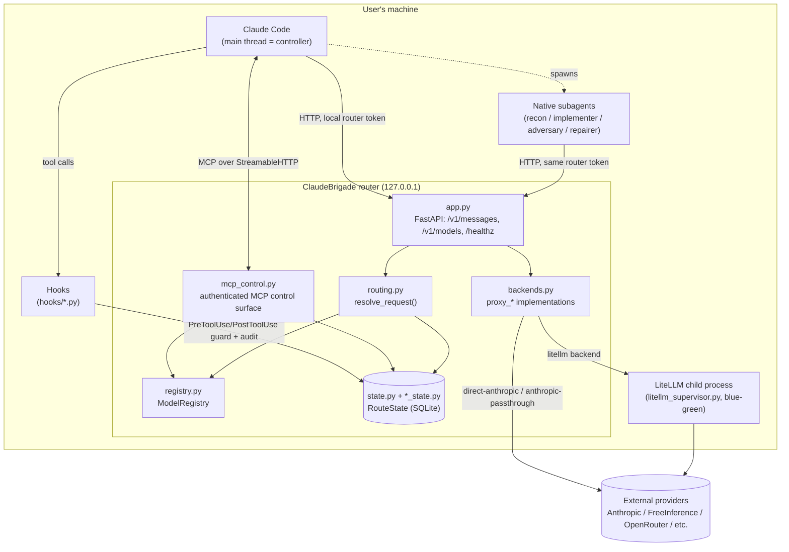
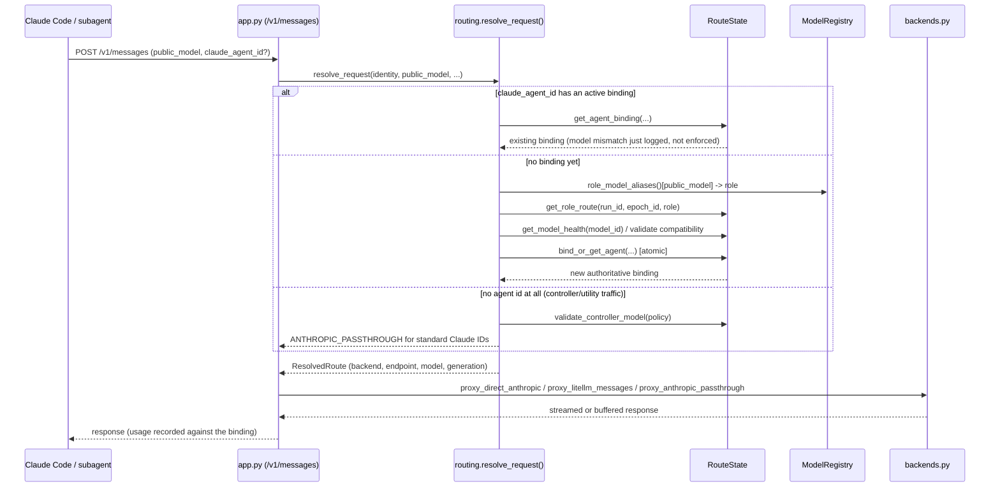
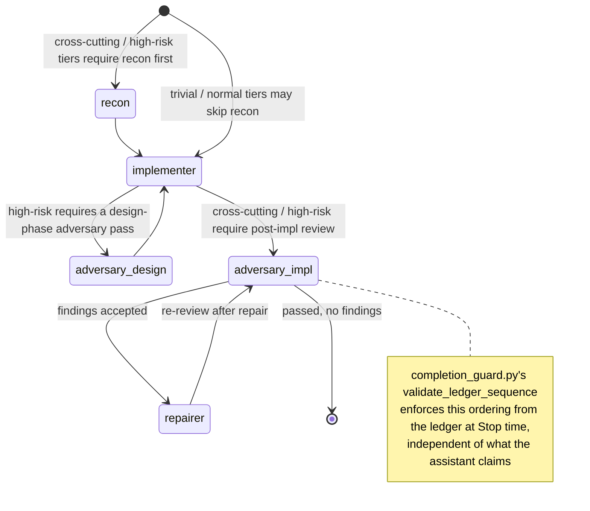
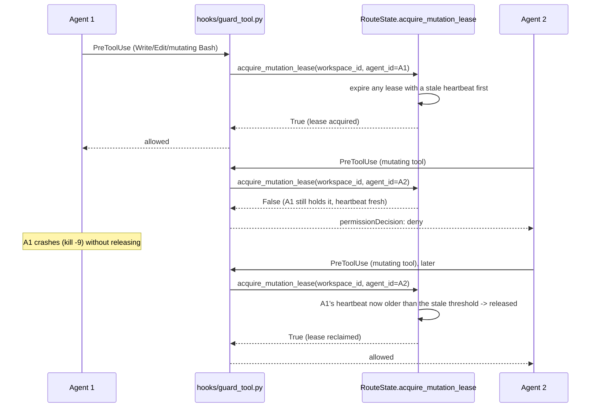
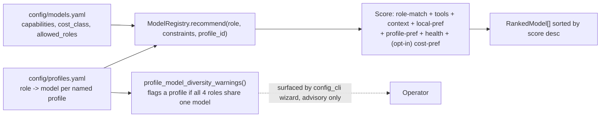

# ClaudeBrigade — how it works

Diagrams of the whole application: the request path, the hook lifecycle that
enforces workflow discipline, the state layer, the workflow/role pipeline,
shadow-workspace integration, and the single-writer safety mechanism. These
are descriptive (drawn from the actual code), not aspirational — see
`ARCHITECTURE.md` for the prose design contract and current-status list.

## 1. System context



Nothing outside this machine ever sees a provider credential directly except
the router process and the LiteLLM child it supervises; Claude Code only ever
holds a local, per-run router token.

## 2. Request routing — `resolve_request()`

Every `/v1/messages` call goes through identity-first dispatch
(`routing.py:resolve_request`), in this order:



A binding is pinned once created — endpoint, backend, generation, config
hash, and certification evidence stay stable for that agent's lifetime, even
across a `managed-group` LiteLLM deployment change underneath it.

## 3. Hook lifecycle across one session

```mermaid
sequenceDiagram
    participant User
    participant CC as Claude Code
    participant H as hooks/*.py
    participant Ledger as ledger.jsonl / SQLite

    CC->>H: SessionStart -> session_start.py
    H->>Ledger: create/resume run, register canonical workspace
    User->>CC: prompt
    CC->>H: UserPromptSubmit -> user_prompt_submit.py
    loop every tool call
        CC->>H: PreToolUse -> guard_tool.py
        H->>Ledger: acquire_mutation_lease() if mutating; deny if another agent holds it
        alt denied
            H-->>CC: permissionDecision: deny
        else allowed
            CC->>CC: run the tool
            CC->>H: PostToolUse -> audit_tool.py
            H->>Ledger: fingerprint workspace, log Mutation/TestExecution/AgentResult events
        end
    end
    opt subagent spawned
        CC->>H: SubagentStart / SubagentStop -> audit_agent.py
        H->>Ledger: agents.jsonl lifecycle + release lease on stop
    end
    CC->>H: Stop -> completion_guard.py
    H->>Ledger: read epoch ledger, check workspace fingerprint
    alt workspace mutated, no valid completion report
        H-->>CC: decision: block (retry-guarded, 3x before requiring explicit failure ack)
    else clean
        H->>Ledger: close_epoch(), clear fingerprint cache
        H-->>CC: allow stop
    end
    CC->>H: SessionEnd -> session_end.py
    H->>Ledger: close run, discard abandoned shadow workspaces
```

`guard_tool.py` and `completion_guard.py` are the two hooks with real
enforcement teeth (they can deny/block); `audit_tool.py` / `audit_agent.py`
are observational logging only.

## 4. `RouteState` module decomposition

```mermaid
classDiagram
    class RouteState {
        +__init__()
        +_new_conn() sqlite3.Connection
        +create_route_snapshot()
        +count_active_bindings_for_generation()
        +fail_litellm_generation_executions()
    }
    class WorkflowPhaseRepository { +start_phase() +complete_phase() +get_ready_phases() }
    class AgentExecutionRepository { +create_agent_execution() +update_agent_execution() }
    class MutationLeaseRepository { +acquire_mutation_lease() +expire_stale_leases() }
    class ShadowWorkspaceRepository { +create_workspace() +create_changeset() +mark_integration_candidate() }
    class ProviderReservationRepository { +reserve_provider_agent() +admit_provider_agents() }
    class RunnableActionRepository { +claim_runnable_action() +reconcile_lifecycle() }
    class RunOrchestrationRepository { +begin_task() +validate_completion() }
    class FindingRepository { +create_finding() +adjudicate_finding() +resolve_finding() }
    class BindingRepository
    class EpochRepository
    class RunRegistryRepository
    class more["...~10 more single-purpose repositories"]

    RouteState --|> WorkflowPhaseRepository
    RouteState --|> AgentExecutionRepository
    RouteState --|> MutationLeaseRepository
    RouteState --|> ShadowWorkspaceRepository
    RouteState --|> ProviderReservationRepository
    RouteState --|> RunnableActionRepository
    RouteState --|> RunOrchestrationRepository
    RouteState --|> FindingRepository
    RouteState --|> BindingRepository
    RouteState --|> EpochRepository
    RouteState --|> RunRegistryRepository
    RouteState --|> more
```



Each `*Repository` mixin only touches its own tables through
`self._new_conn()`; cross-repository calls (e.g. a shadow-workspace method
calling `self.create_finding(...)`) resolve at runtime through ordinary
Python multiple-inheritance MRO. `state.py` itself keeps only schema
migrations and the few methods that deliberately span more than one
repository's tables.

## 5. Workflow tier / role pipeline



Tier (`trivial` / `normal` / `cross-cutting` / `high-risk`) is classified by
`policy.py` and determines which of these gates actually apply. Only one
mutating agent may hold the workspace at a time regardless of how many
phases are graph-parallel (see §7) — non-mutating phases (e.g. a
`parallel_group: recon` fan-out) can run concurrently; mutating phases are
serialized both by phase-activation logic and by the mutation lease.

## 6. Shadow workspace + integration escalation

```mermaid
sequenceDiagram
    participant Worker as Subagent (isolated git worktree)
    participant SW as shadow_worktree.py
    participant State as RouteState
    participant Ctrl as Controller (Claude Code main thread)

    Worker->>SW: writes land in its own worktree, never the main checkout
    Ctrl->>SW: validate_execution_workspace / create_changeset (git apply --check preflight)
    SW->>SW: classify_overlap() vs prior changesets
    alt patch invalid or unauthorized files
        SW->>State: create_integration_candidate(disposition="red")
        SW->>State: escalate_red_candidate() -> create_finding() + adjudicate_finding("accepted")
        Note over State: finding now visible to evaluate_condition's<br/>accepted_findings gate, not just a poll-only table
    else overlaps a prior changeset's files
        SW->>State: create_integration_candidate(disposition="yellow")
        Note over Ctrl: requires explicit controller_approval to integrate
    else no overlap, valid patch
        SW->>State: create_integration_candidate(disposition="green")
    end
    Ctrl->>SW: integrate_shadow_changeset() (green: automatic; yellow: needs approval; red: refused)
    alt integrate_green() raises during actual apply
        SW->>State: mark_integration_candidate(disposition="red")
        SW->>State: escalate_red_candidate()
    else success
        SW->>State: update_workspace_status("merged")
    end
    Ctrl->>SW: resolve_shadow_candidate(decision=discard|retry) for any red candidate
    SW->>State: resolve_finding(..., "irrelevant")
```

No `git reset --hard` / `git clean` ever runs against the main checkout;
conflicts are detected deterministically (`git apply --check`) and either
block automatically (red) or require explicit approval (yellow) — never
auto-merged.

## 7. Mutation lease — single-writer enforcement



The reclaim happens lazily, inline, on every `acquire_mutation_lease` call —
there's no separate scheduled sweep to depend on, so a crashed holder can't
lock the workspace forever even across a router restart (the lease is a
durable SQLite row, not in-memory state).

## 8. Model/profile resolution


