# ClaudeBrigade — how it works

Diagrams of the whole application: the request path, the hook lifecycle that
enforces workflow discipline, the state layer, the native Claude Code slots,
independently routed sidecar workers, bounded coprocessors,
shadow-workspace integration, and provider admission. These are descriptive
(drawn from the actual code), not aspirational — see `ARCHITECTURE.md` for the
prose design contract and current-status list.

## 1. System context

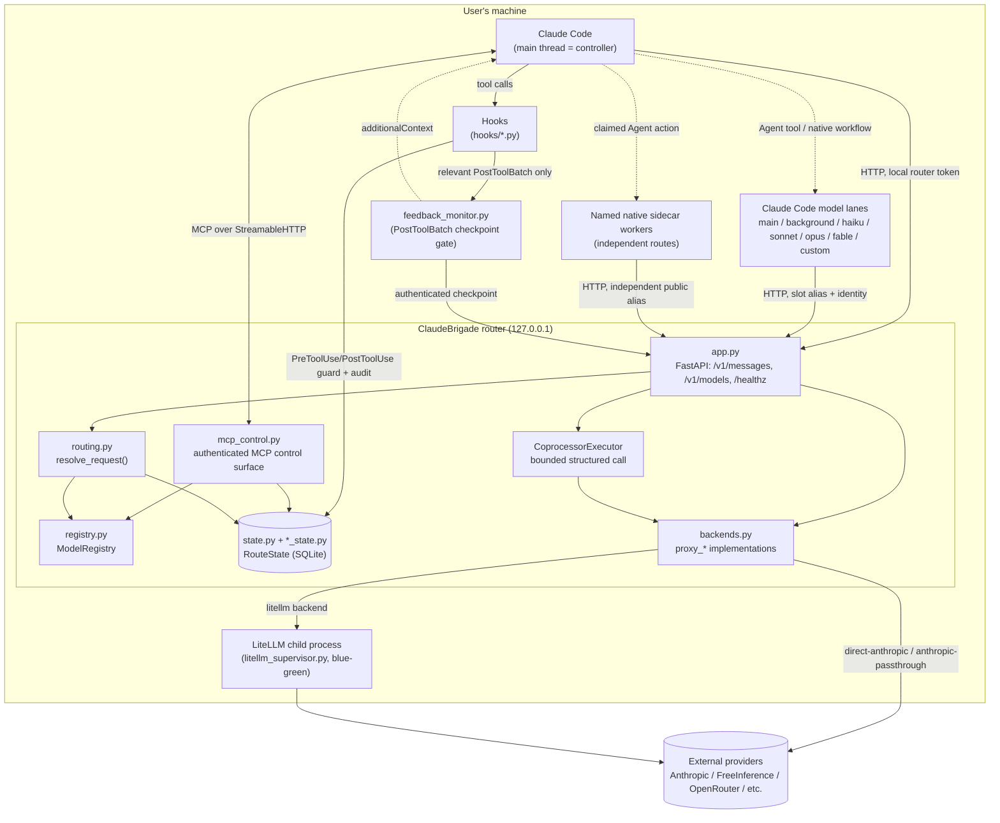

Nothing outside this machine ever sees a provider credential directly except
the router process and the LiteLLM child it supervises; Claude Code only ever
holds a local, per-run router token.

## 2. Request routing — `resolve_request()`

Every `/v1/messages` call goes through identity-first dispatch
(`routing.py:resolve_request`), in this order:

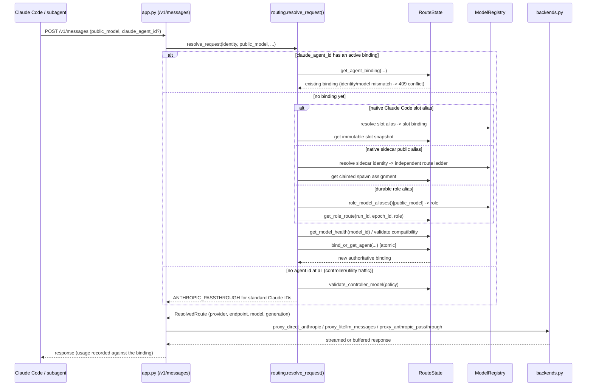

A binding is pinned once created — endpoint, backend, generation, config
hash, and certification evidence stay stable for that agent's lifetime, even
across a `managed-group` LiteLLM deployment change underneath it.

## 3. Hook lifecycle across one session

```mermaid
sequenceDiagram
    participant User
    participant CC as Claude Code
    participant H as hooks/*.py
    participant Ledger as ledger.jsonl / SQLite

    CC->>H: SessionStart -> session_start.py
    H->>Ledger: create/resume run, register canonical workspace
    User->>CC: prompt
    CC->>H: UserPromptSubmit -> user_prompt_submit.py
    loop every tool call
        CC->>H: PreToolUse -> guard_tool.py
        H->>Ledger: acquire_mutation_lease() if mutating; deny if another agent holds it
        alt denied
            H-->>CC: permissionDecision: deny
        else allowed
            CC->>CC: run the tool
            CC->>H: PostToolUse -> audit_tool.py
            H->>Ledger: fingerprint workspace, log Mutation/TestExecution/AgentResult events
        end
        CC->>H: PostToolBatch -> audit_tool.py + feedback_monitor.py
        H->>H: local watched-tool filter (no provider call on miss)
        opt fresh feedback checkpoint
            H->>Ledger: claim dedupe/cooldown/budget/parallelism atomically
            H->>App: POST /internal/feedback/checkpoint
            App->>Ledger: verify run/epoch and provider budget
            App->>Coproc: start bounded coprocessor execution
            Coproc-->>App: advisory structured result
            App-->>H: feedback result or pending receipt
            H-->>CC: hookSpecificOutput.additionalContext
        end
    end
    opt subagent spawned
        CC->>H: SubagentStart / SubagentStop -> audit_agent.py
        H->>Ledger: agents.jsonl lifecycle + release lease on stop
    end
    CC->>H: Stop -> completion_guard.py
    H->>Ledger: read epoch ledger, check workspace fingerprint
    alt workspace mutated, no valid completion report
        H-->>CC: decision: block (retry-guarded, 3x before requiring explicit failure ack)
    else clean
        H->>Ledger: close_epoch(), clear fingerprint cache
        H-->>CC: allow stop
    end
    CC->>H: SessionEnd -> session_end.py
    H->>Ledger: close run, discard abandoned shadow workspaces
```

`guard_tool.py` and `completion_guard.py` are the two hooks with real
enforcement teeth (they can deny/block); `audit_tool.py` / `audit_agent.py`
are observational logging only.

## 4. `RouteState` module decomposition

```mermaid
classDiagram
    class RouteState {
        +__init__()
        +_new_conn() sqlite3.Connection
        +create_route_snapshot()
        +count_active_bindings_for_generation()
        +fail_litellm_generation_executions()
    }
    class WorkflowPhaseRepository { +start_phase() +complete_phase() +get_ready_phases() }
    class AgentExecutionRepository { +create_agent_execution() +update_agent_execution() }
    class FeedbackRepository { +claim_feedback_checkpoint() +complete_feedback() +get_ready_feedback() +mark_feedback_delivered() +reconcile_feedback() +adjudicate_feedback() +get_coprocessor_outcome_metrics() }
    class MutationLeaseRepository { +acquire_mutation_lease() +expire_stale_leases() }
    class ShadowWorkspaceRepository { +create_workspace() +create_changeset() +mark_integration_candidate() }
    class ProviderReservationRepository { +reserve_provider_agent() +admit_provider_agents() }
    class ResourcePolicyRepository { +get_run_resource_policy() +get_run_resource_capacity() +assert_run_resource_capacity() }
    class RunnableActionRepository { +claim_runnable_action() +reconcile_lifecycle() }
    class RunOrchestrationRepository { +begin_task() +validate_completion() }
    class ContractRepository { +publish_task_contract() +add_requirement() +get_requirement_coverage() }
    class WorkPackageRepository { +publish_work_package() +get_ready_work_packages() +update_work_package() }
    class EscalationRepository { +get_escalation_state() +propose_escalation() +escalate_epoch() }
    class FindingRepository { +create_finding() +adjudicate_finding() +resolve_finding() }
    class BindingRepository
    class EpochRepository
    class RunRegistryRepository
    class more["...~10 more single-purpose repositories"]

    RouteState --|> WorkflowPhaseRepository
    RouteState --|> AgentExecutionRepository
    RouteState --|> FeedbackRepository
    RouteState --|> MutationLeaseRepository
    RouteState --|> ShadowWorkspaceRepository
    RouteState --|> ProviderReservationRepository
    RouteState --|> ResourcePolicyRepository
    RouteState --|> RunnableActionRepository
    RouteState --|> RunOrchestrationRepository
    RouteState --|> ContractRepository
    RouteState --|> WorkPackageRepository
    RouteState --|> EscalationRepository
    RouteState --|> FindingRepository
    RouteState --|> BindingRepository
    RouteState --|> EpochRepository
    RouteState --|> RunRegistryRepository
    RouteState --|> more
```

Each `*Repository` mixin only touches its own tables through
`self._new_conn()`; cross-repository calls (e.g. a shadow-workspace method
calling `self.create_finding(...)`) resolve at runtime through ordinary
Python multiple-inheritance MRO. `state.py` itself keeps only schema
migrations and the few methods that deliberately span more than one
repository's tables.

## 4a. Controller-owned adaptive orchestration

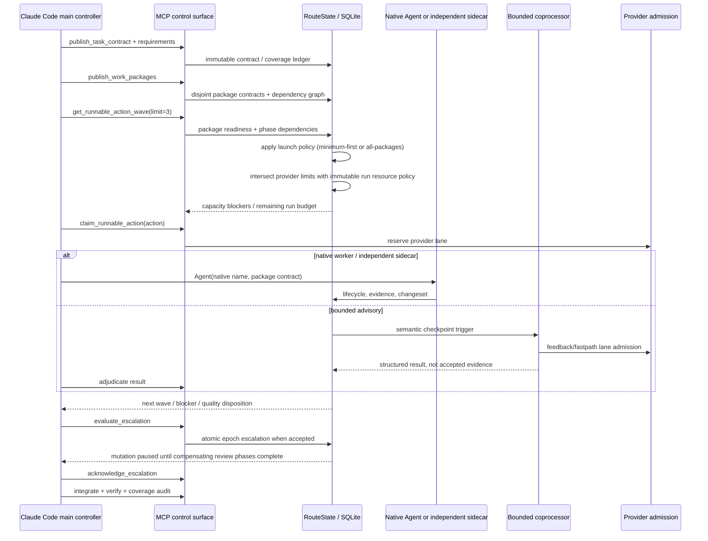

The controller owns the contract and coverage ledger. Native workers own their
isolated package execution. Coprocessors remain compact advisory calls and are
visually distinct from native workers. Provider limits apply across request
types; the default FreeInference limit of four keeps one controller lane
available while admitting at most three ordinary worker requests. The run
resource policy is a second, persisted ceiling: it limits total native
workers, mutators, reviewers, coprocessors, worktrees, reserved tokens, and
deadline independently of which provider each action uses. Planning may show
an action, but the claim transaction is the final admission check.

## 5. Workflow tier / role pipeline

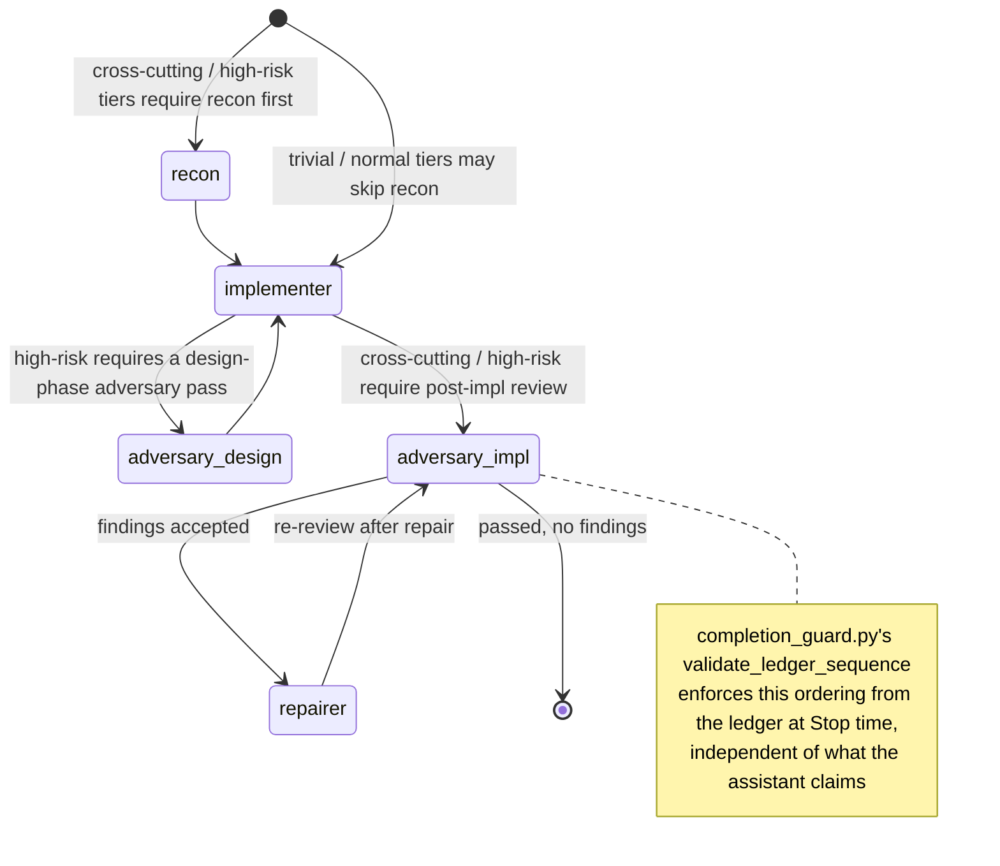

Tier (`trivial` / `normal` / `cross-cutting` / `high-risk`) is classified by
`policy.py` and determines which of these gates actually apply. Each provider
has its own configured admission limit. For the default FreeInference policy,
`max_concurrency: 4` reserves one controller permit and admits at most three
worker requests. Mutating workers can run concurrently only in distinct
worktrees with disjoint work packages; canonical integration remains the
single serialized writer.

## 6. Shadow workspace + integration escalation

```mermaid
sequenceDiagram
    participant Worker as Subagent (isolated git worktree)
    participant SW as shadow_worktree.py
    participant State as RouteState
    participant Ctrl as Controller (Claude Code main thread)

    Worker->>SW: writes land in its own worktree, never the main checkout
    Ctrl->>SW: validate_execution_workspace / create_changeset (git apply --check preflight)
    SW->>SW: classify_overlap() vs prior changesets
    alt patch invalid or unauthorized files
        SW->>State: create_integration_candidate(disposition="red")
        SW->>State: escalate_red_candidate() -> create_finding() + adjudicate_finding("accepted")
        Note over State: finding now visible to evaluate_condition's<br/>accepted_findings gate, not just a poll-only table
    else overlaps a prior changeset's files
        SW->>State: create_integration_candidate(disposition="yellow")
        Note over Ctrl: requires explicit controller_approval to integrate
    else no overlap, valid patch
        SW->>State: create_integration_candidate(disposition="green")
    end
    Ctrl->>SW: integrate_shadow_changeset() (green: automatic; yellow: needs approval; red: refused)
    alt integrate_green() raises during actual apply
        SW->>State: mark_integration_candidate(disposition="red")
        SW->>State: escalate_red_candidate()
    else success
        SW->>State: update_workspace_status("merged")
    end
    Ctrl->>SW: resolve_shadow_candidate(decision=discard|retry) for any red candidate
    SW->>State: resolve_finding(..., "irrelevant")
```

No `git reset --hard` / `git clean` ever runs against the main checkout;
conflicts are detected deterministically (`git apply --check`) and either
block automatically (red) or require explicit approval (yellow) — never
auto-merged.

## 7. Mutation lease — per-workspace enforcement

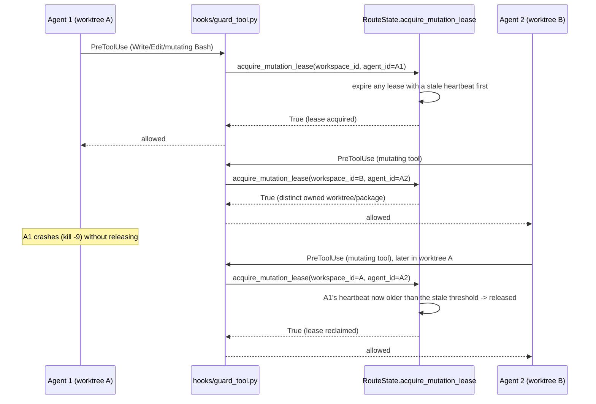

The reclaim happens lazily, inline, on every `acquire_mutation_lease` call —
there's no separate scheduled sweep to depend on, so a crashed holder can't
lock the workspace forever even across a router restart (the lease is a
durable SQLite row, not in-memory state).

## 8. Model/profile resolution

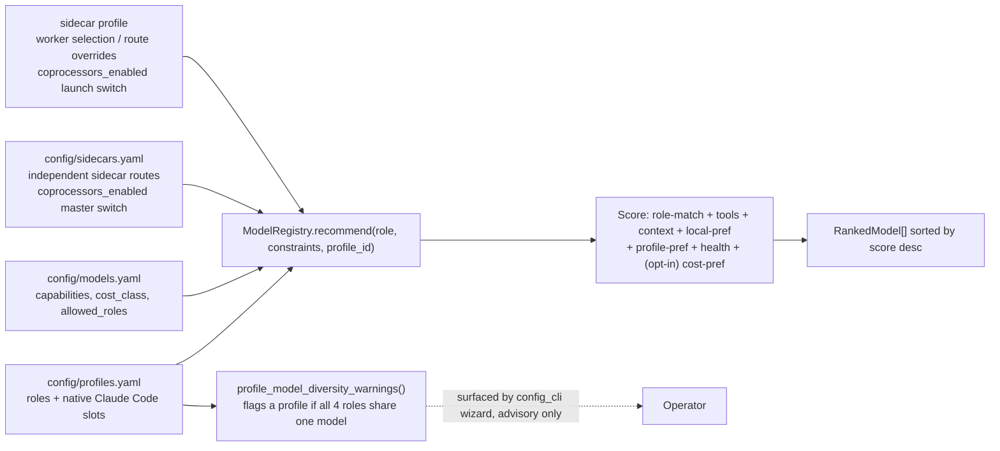

## 9. Automatic coprocessor feedback monitor

The monitor is deliberately outside the model's tool-choice loop. Claude Code
invokes the `PostToolBatch` hook; the hook performs a cheap local relevance
check, and the router's persisted checkpoint ledger decides whether a model
request is justified.

```mermaid
sequenceDiagram
    participant CC as Claude Code agent
    participant Hook as feedback_monitor.py
    participant App as app.py /internal/feedback/checkpoint
    participant Reg as ModelRegistry
    participant State as RouteState / SQLite
    participant Coproc as CoprocessorExecutor
    participant Admit as ProviderAdmissionManager
    participant Provider as Configured provider

    CC->>Hook: PostToolBatch(tool names + bounded results)
    Hook->>Hook: watched-tool filter
    alt no relevant tool
        Hook-->>CC: no output; no router/model call
    else relevant tool
        Hook->>App: authenticated checkpoint packet
        App->>Reg: resolve feedback policy + selected coprocessor
        alt global or selected-profile coprocessors_enabled=false
            Reg-->>App: bounded lane disabled
            App-->>Hook: no model call
        else lane enabled
        App->>Admit: inspect current provider worker budget
        alt provider worker budget is full
            App-->>Hook: deferred; protect controller lane
            Hook-->>CC: no model context
        else candidate has capacity
            App->>State: BEGIN IMMEDIATE claim
            State->>State: evidence digest + cooldown + call budget + parallelism
            alt duplicate, cooldown, or budget exhausted
                State-->>App: no new call
                App-->>Hook: pending/deferred/deduplicated
            else fresh checkpoint admitted
                App->>Coproc: invoke_feedback(parent execution, bounded packet)
                Coproc->>Admit: acquire shared provider request permit
                Coproc->>Provider: one bounded structured request
                Provider-->>Coproc: advisory JSON result
                Coproc->>Admit: release request permit
                Coproc->>State: persist completed result (not accepted)
                State-->>App: ready delivery receipt
                App-->>Hook: advisory feedback + feedback_id
                Hook-->>CC: hookSpecificOutput.additionalContext
            end
        end
        end
    end
```

Transport completion is not workflow acceptance. The controller must inspect
the bounded result and call `adjudicate_coprocessor_result` before a
co-processor phase can satisfy quorum. Delivered automatic feedback is later
closed with `adjudicate_feedback` (`adopted`, `rejected_incorrect`,
`ignored_stale`, and related dispositions); ready results are drained once at
the next relevant checkpoint and stale/running rows are reconciled after a
router restart.

Merge-risk verification is queued asynchronously before deterministic
integration. A late `fail` or `escalate` result becomes a durable controller
finding through the normal findings/integration workflow; it never silently
authorizes, reverses, or rewrites canonical state.

The hot path therefore scales with hook events but model traffic scales only
with admitted evidence changes. A pending call may finish asynchronously and
be injected at the next fresh checkpoint. Feedback is advisory: it cannot
authorize a tool, mutate a worktree, integrate a changeset, or satisfy a
completion gate.

## 10. Native slots and independent sidecar routes

The six persistent Claude Code model lanes plus optional custom route and
ClaudeBrigade sidecars are additive, not interchangeable:

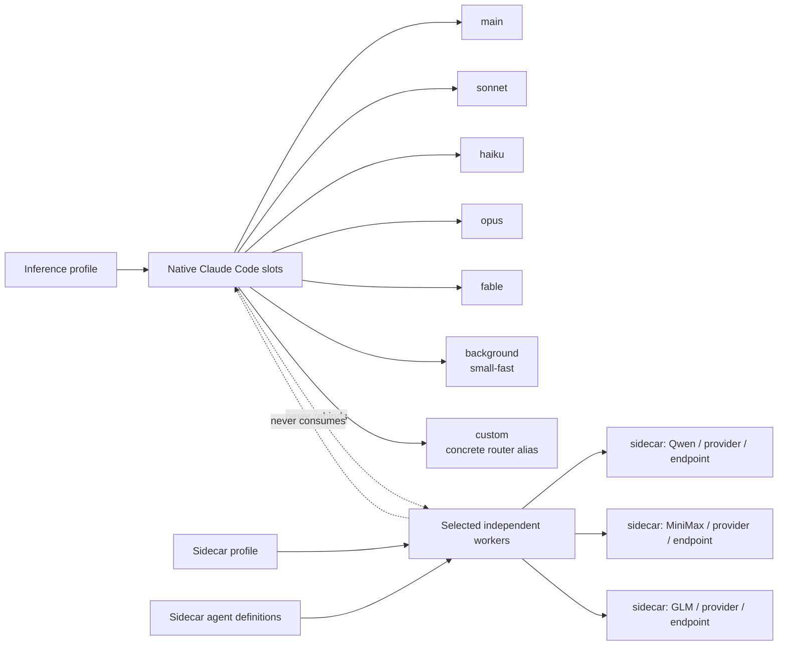

Slot selection controls Claude Code's native model alias or execution-lane
environment variable. A native sidecar
selection carries its own exact `(provider_id, model_id, endpoint_id)` route
and public identity. A sidecar may use the same logical model as a slot, but it
is still a separate binding, admission request, execution, and lifecycle.

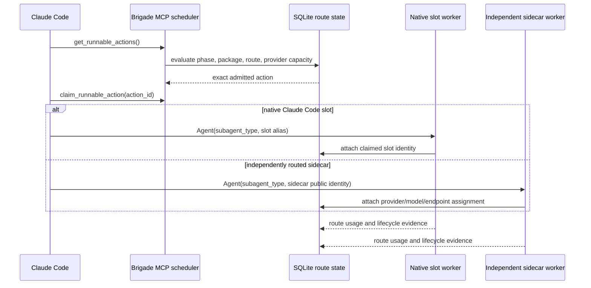

The scheduler is shared, but the route namespaces are not. Sidecar profiles
can select workers and apply per-worker route overrides without changing the
five native slot bindings.

A launch preset chooses which workflow composition uses those two namespaces:

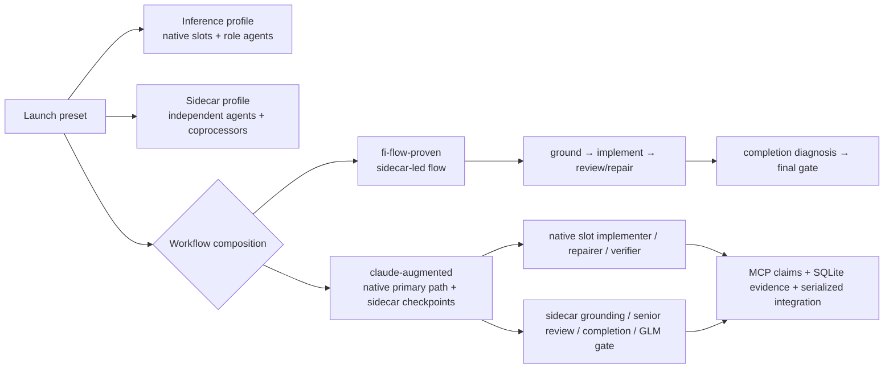

The two paths are intentionally selectable rather than silently blended. The
augmented path combines both systems in one run, while the proven path makes
the sidecar workflow independently testable and keeps its route/model usage
visible in state.

## 11. Provider admission and route identity

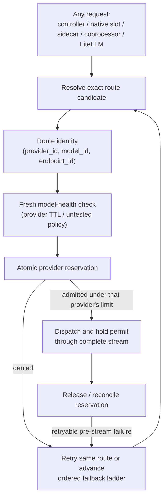

Admission is per provider, not a global “four model” limit. For example,
FreeInference can be configured for four active requests with one controller
reserve and three worker permits, while OpenRouter or NVIDIA NIM use their own
configured limits. Requests routed to different providers do not consume the
same provider counter. A coprocessor still consumes the selected provider's
permit when it makes an actual model request.

The ordered fallback ladder preserves provider and endpoint identity. A
fallback is not merely another model string:

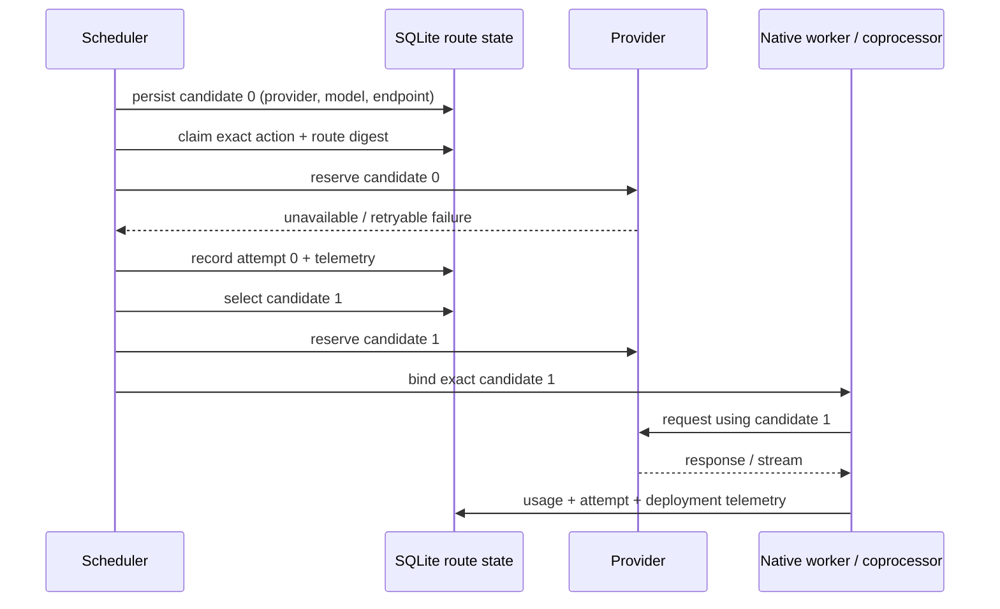

Reservations persist the logical model identity. At queue time and again when
capacity is promoted, the scheduler evaluates the latest health record using
that provider's `health_max_age_seconds` and `allow_untested_models` policy.
Stale or failed candidates expire and are skipped so they cannot poison the
queue ahead of a healthy fallback.

Once response bytes have started, the router does not silently replay the
request through another provider. Native worker cancellation, user
cancellation, policy rejection, and restart reconciliation are recorded as
lifecycle outcomes and do not automatically advance a provider/model fallback
ladder.

## 12. Native worktree lifecycle

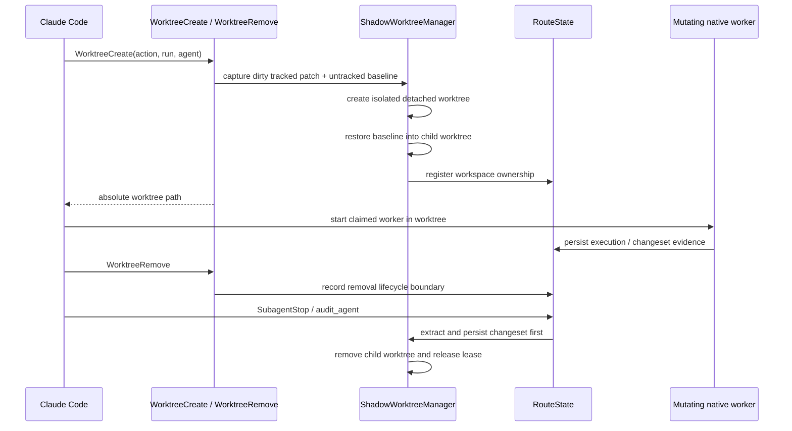

The canonical checkout is never reset or cleaned to create a worker. Dirty
tracked and untracked user state is copied into the child baseline. The
WorktreeRemove hook records the boundary, while the terminal native-agent
lifecycle extracts and persists the changeset before cleanup. A failed
lifecycle step remains visible as an orphaned workspace for reconciliation
rather than being silently discarded.

## 13. Durable telemetry and restart reconciliation

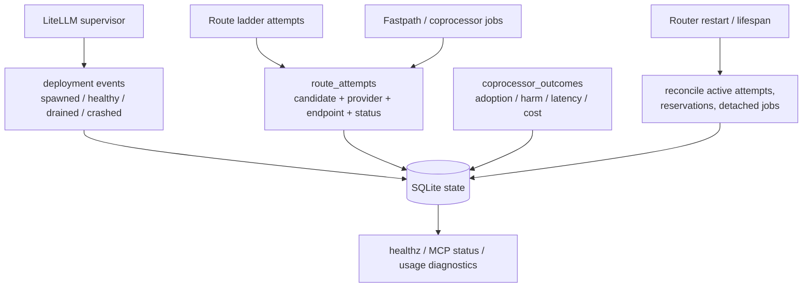

Telemetry is evidence, not routing authority. It records which exact
candidate and physical deployment were attempted, what failed, what was
recovered, and what usage was observed. On restart, active route attempts and
reservations are reconciled into explicit lifecycle outcomes before new work
is admitted.
